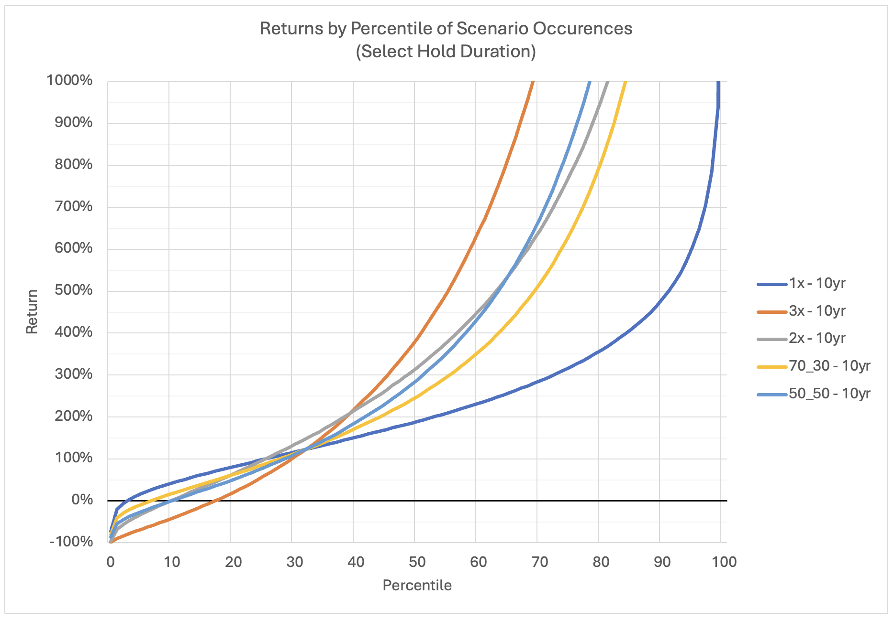

# Leveraged ETF Simulator

The Leveraged ETF Simulator repository contains Python scripts for simulating and analyzing the performance of leveraged exchange traded funds (ETFs) against an underlying index over thousands or millions of years. The simulation generates annual returns for the underlying index and its leveraged ETF counterparts, and optional blends between ETFs, based on a given configuration. The simulation data is then aggregated to generate performance metrics and probabilities. The repository includes scripts for running the simulation and aggregation, either together or independently, and a configuration file for specifying the parameters of the simulation. The results of the simulation are written to a JSON file and the results of the performance analysis are written to two CSV files.

## Table of Contents

- [Installation](#installation)
- [Usage](#usage)
- [Files](#files)
- [Configuration](#configuration)
- [Scripts Description](#scripts-description)
- [FAQ](#faq)
  1. [How do I run this?](#1-how-do-i-run-this)
  2. [How long does it take to run?](#2-how-long-does-it-take-to-run)
  3. [How many years should I simulate?](#3-how-many-years-should-i-simulate)
  4. [What are the outputs?](#4-what-are-the-outputs)
  5. [How do I interpret the results?](#5-how-do-i-interpret-the-results)
  6. [What are the *year* values?](#6-what-are-the-year-values)
  7. [How do I know what values to assign in `config.yml`?](#7-how-do-i-know-what-values-to-assign-in-configyml)
  8. [How can I visualize the results?](#8-how-can-i-visualize-the-results)

## Installation

To use this simulation, clone the repository to your local machine.

## Usage

To run the simulation and aggregation, execute the `run_both.py` script. It can be be run from the root directory of the project (or any of its enclosing directories provided the correct filepath is used in the shell command).

```bash
python3 logic/run_both.py
```

Optional: If you wish to run the simulation or aggregation individually, you can execute those scripts independently.
```bash
python3 logic/run_simulation.py
python3 logic/run_aggregation.py
```

These scripts can also be executed from within your IDE.

## Files

The repository contains the following key files:

- `run_both.py`: This is the main script that you should run. It executes both the simulation and the aggregation scripts.
- `run_simulation.py`: This script simulates the annual returns for the ETFs based on the configuration provided in `config.yml`.
- `run_aggregation.py`: This script aggregates the simulated data and writes the results to a CSV file.
- `helper.py`: This script contains helper functions used by other scripts.
- `thread_timer.py`: This script contains a thread that prints the elapsed time.
- `config.yml`: This is the configuration file where you can specify the parameters for the simulation.

## Configuration

This is a configuration file that specifies the parameters for the simulation and aggregation scripts. It includes the annual return and standard deviation of the index, the federal funds rate, the number of years to simulate, and the properties of the ETFs and blends. It contains the following parameters:

- `index_annual_return`: The expected annual return.
- `index_annual_standard_deviation`: The expected annual standard deviation.
- `fed_funds_annual_rate`: The annual federal funds rate.
- `years_to_simulate`: The number of years to simulate.
- `etfs`: A dictionary where the keys are the names of the ETFs and the values are dictionaries containing the multiple for each ETF.
- `blends`: A dictionary where the keys are the names of the blends and the values are dictionaries containing the proportion of each ETF in the blend.

Here is an example configuration:

```yaml
index_annual_return: 0.1281
index_annual_standard_deviation: 0.1721
fed_funds_annual_rate: 0.03
years_to_simulate: 10000
etfs: {
  # 1x represents the underlying index
  1x: {
    multiple: 1,
    annual_expense_ratio: 0
  },
  2x: {
    multiple: 2,
    annual_expense_ratio: 0.0091
  },
  3x: {
    multiple: 3,
    annual_expense_ratio: 0.0092
  }
}
blends: {
  '70_30': {
    1x: 0.7,
    3x: 0.3
  },
  '50_50': {
    1x: 0.5,
    3x: 0.5
  }
}
```

## Scripts Description

#### `run_simulation.py`

This script simulates the performance of different Exchange Traded Funds (ETFs) over a specified number of years. The ETFs and their properties are defined in a configuration file. The script generates random daily returns based on the specified annual return and standard deviation, and calculates the cumulative return for each ETF. The simulation results are then written to a JSON file.

#### `run_aggregation.py`

This script reads the simulation data generated by `run_simulation.py` and calculates various statistics for each ETF over different time frames. These statistics include the return percentiles and the probabilities of positive return and beating the index. The script also calculates the return percentiles for different blends of ETFs as defined in the configuration file. The results are written to two CSV files: one for the return percentiles and one for the return probabilities.

#### `helper.py`

This script contains a helper function `getAbsPath` that returns the absolute path of the `letf-simulation` directory. This helps make the file management in the scripts less brittle and simplifies the repository structure. It also allows for the scripts to be executed as shell commands from anywhere within the project.

#### `thread_timer.py`

This script defines a thread that prints the elapsed time since it was started. It is used in `run_aggregation.py` to display the progress of the data aggregation process.

#### `run_both.py`

This script runs both the simulation and aggregation scripts. It first executes `run_simulation.py` to generate the simulation data, and then executes `run_aggregation.py` to calculate and write the statistics.

## FAQ

### 1. How do I run this?

```bash
python3 logic/run_both.py
```
See [Usage](#usage) and [`run_both.py`](#run_bothpy) for more information.

### 2. How long does it take to run?

My M1 Pro simulates about 4,300 years/sec and aggregates about 1,200 years/sec.

### 3. How many years should I simulate?

Up to you! As you might expect, the results converge as you simulate more years of the market. I recommend a minimum of 10,000 years but ideally more. You can easily run millions of years if you don't mind waiting a few minutes.

### 4. What are the outputs?

There are three output files, that are generated in a `results` folder:

- `annual_sim_data.json`, which is generated by `run_simulation.py` and consumed by `run_aggregation.py`
- `results_percentiles.csv`, which is generated by `run_aggregation.py`
- `results_probabilities.csv`, which is generated by `run_aggregation.py`

### 5. How do I interpret the results?

You there are two files of results that are generated, `results_percentiles.csv` and `results_probabilities.csv`.

#### Here is an example of `results_percentiles.csv`:

| etf	| year_value | year_name | percentile | return |
| --- | --- | --- | --- | --- |
| ... | ... | ... | ... | ... |
| 3x	| 5	| 5yr	| 58.1	| 1.798304797 |
| 3x	| 5	| 5yr	| 58.2	| 1.805510373 |
| 3x	| 5	| 5yr	| 58.3	| 1.812721397 |
| ... | ... | ... | ... | ... |

The returns for all of the years (or buckets of years) of the simulation are ranked, for each etf, to the the tenth of a percentile. The **percentile** value is in percentage form. For instance, 75.5 represents 75.5th percentile, and 50.0 represents the 50th percentile, which is the median. The **return** is a zero-based cumulative return. For instance, 0.5 is a +50% percent cumulative gain, 0.0 is a 0% return (meaning the value your investment is unchanged), and -0.5 is 50% cumulative loss.

#### Here is an example of `results_probabilities.csv`:

| etf | year_value | year_name | probability_positive_return | probability_beat_index |
| --- | --- | --- | --- | --- |
| ... | ... | ... | ... | ... |
| 3x | 1 | 1yr | 0.621 | 0.56 |
| 3x | 3 | 3yr | 0.699 | 0.602 |
| 3x | 5 | 5yr | 0.751 | 0.631 |
| ... | ... | ... | ... | ... |

The **probability_positive_return** and **probability_beat_index** values are probability percentages. For instance, 0.5 represents a 50% chance, or coin-toss odds, of achieving the corresponding outcome, a value of 1 means that the outcome is guaranteed, and a value of 0 means that the outcome is impossible.

### 6. What are the *year* values?

The *year* values that you find in the results are buckets of consecutive years, to represent the duration for which an etf is held. So a year value of 1 means the etf is held for exactly 1 year, 5 means 5 years, etc. The following year buckets are pre-defined and all year buckets will always be calculated for every etf/blend:
- `1yr`
- `3yr`
- `5yr`
- `10yr`
- `15yr`
- `20yr`
- `30yr`

### 7. How do I know what values to assign in `config.yml`?

Assign values that are appropriate for the index that you intend to replicate, based on the index's historical average returns and standard deviation.

The script is set to simulate the S&P 500 by default. From 1950 and through 2023, the S&P 500 has had an average annual return (with dividends included) of 12.81% with a standard deviation of 17.21%, so those are the values you will see assigned in the `config.yml`.

The Federal Funds Rate is notoriously hard, if not impossible to predict. I have gone with 3% as the default based on a very rough approximation of recent history and Fed policies, but you should use a rate that you are most comfortable with.

### 8. How can I visualize the results?

However you like! Here's one example using Excel (connecting to the csv outputs) charting returns over percentiles by etf (filtering for a certain duration). Have fun 😄


